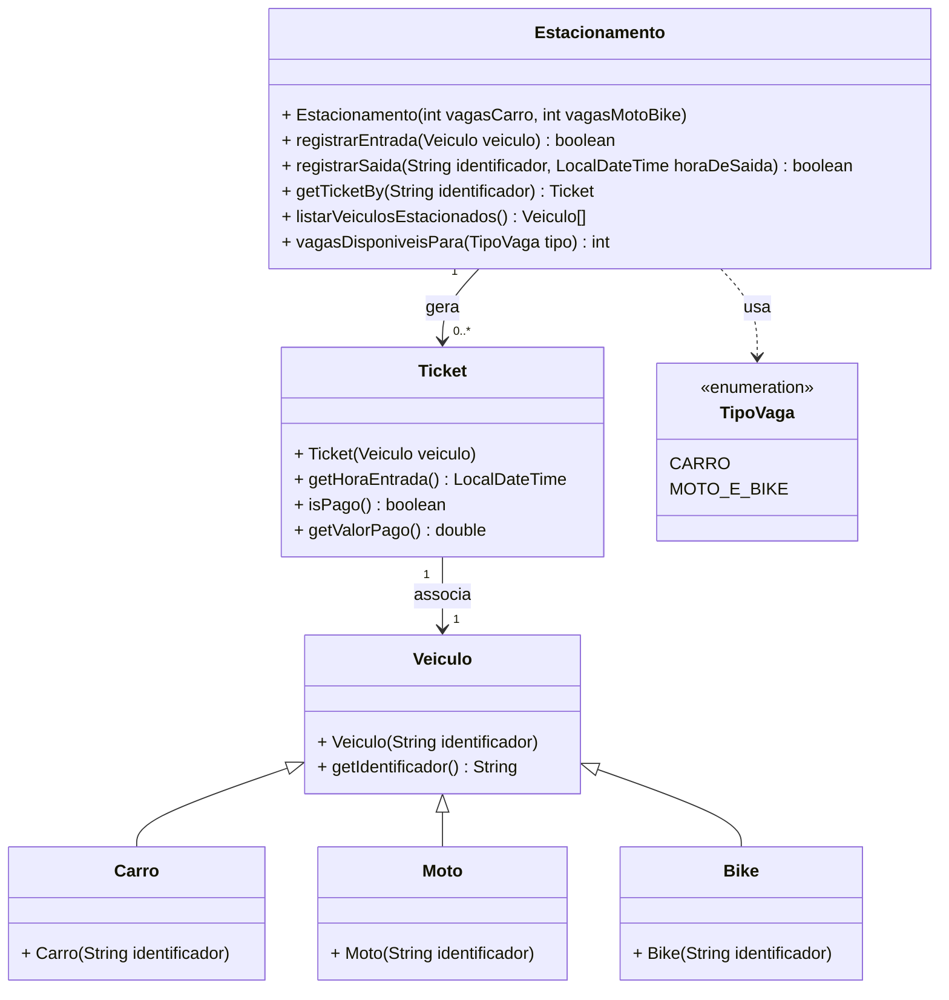

# :parking: Sistema de Gerenciamento de Estacionamento com Herança


<a href="https://www.vecteezy.com/free-vector/parking">Fonte: Parking Vectors by Vecteezy</a>

Você foi contratado para desenvolver um Sistema de Gerenciamento de Estacionamento que registra a entrada e saída de veículos, calcula o valor a ser pago pelo tempo de permanência, e armazena informações importantes sobre os tickets emitidos.

O estacionamento possui vagas separadas para carros e para motos/bikes. Ao entrar no estacionamento, o veículo recebe um ticket, que contém informações sobre o horário de entrada, o horário de saída e o valor pago. O ticket é gerado automaticamente ao registrar a entrada do veículo.

Cada tipo de veículo tem uma forma diferente de calcular o valor a pagar, que depende do tempo de permanência no estacionamento.

## 🎯 Requisitos Funcionais


### ✅ Registrar Entrada de Veículo

1. O sistema deve permitir a entrada de veículos, gerando um ticket associado ao veículo. O horário de entrada do ticket é o momento em que ele é criado.
2. Cada veículo deve ser registrado com seu identificador único, a placa.
3. A quantidade de vagas de cada tipo é definida ao criar o estacionamento e pode ser zero (nesse caso, nenhum veículo daquele tipo pode entrar).
4. O sistema deve verificar se há vagas disponíveis para o tipo de veículo:
   - Carro ocupa uma vaga de carro (`TipoVaga.CARRO`).
   - Moto e bike ocupam uma vaga de moto/bike (`TipoVaga.MOTO_E_BIKE`).
5. Caso não haja vaga disponível para o tipo de veículo, a entrada deve ser recusada (`registrarEntrada` retorna `false`). Nesse caso, o sistema deve exibir uma mensagem indicando que o veículo não pode ser registrado devido à falta de vagas.
6. Um veículo que já está estacionado não pode registrar uma nova entrada (`registrarEntrada` retorna `false`).
7. Depois de sair, o mesmo veículo pode voltar a estacionar, recebendo um novo ticket.

---

### ✅ Registrar Saída de Veículo e Pagar o Ticket

1. O sistema deve permitir que um veículo saia do estacionamento, informando sua placa e o horário de saída.
2. Ao registrar a saída, o ticket é pago:
   1. O horário de saída é registrado.
   2. O sistema calcula o valor a ser pago, com base no tempo de permanência.
   3. O ticket é marcado como pago.
   4. A vaga ocupada pelo veículo é liberada.
3. A saída deve ser recusada (`registrarSaida` retorna `false`) quando:
   - não existir ticket para a placa informada;
   - o ticket da placa informada já tiver sido pago;
   - o horário de saída informado for anterior ao horário de entrada. Nesse caso o ticket continua não pago e o veículo continua estacionado.

---

### ✅ Calcular Valor a Pagar
Cada tipo de veículo tem sua própria regra de cálculo, aplicada sobre o tempo de permanência em minutos. Toda fração de minuto é cobrada como um minuto inteiro (por exemplo, 60 minutos e 1 segundo são cobrados como 61 minutos):

| Tipo de Veículo | 	Regra de Cálculo           | Valor Mínimo |
|---|-----------------------------|--------------|
|Carro	| R$ 0,10 por minuto          | 	R$ 5,00     |
|Moto	| R$ 0,05 por minuto | 	R$ 3,00     |
|Bike	|Valor fixo de R$ 3,00|	R$ 3,00 |

Exemplos: um carro que permanece 5 horas (300 minutos) paga R$ 30,00; uma moto que permanece 30 minutos pagaria R$ 1,50, mas paga o mínimo de R$ 3,00.

---

### ✅ Consultar o Estacionamento

1. O sistema deve informar quantas vagas ainda estão disponíveis para cada tipo de vaga (`vagasDisponiveisPara`).
2. O sistema deve permitir consultar o ticket de um veículo a partir da sua placa (`getTicketBy`). Com o ticket é possível obter o horário de entrada, se ele já foi pago e o valor pago.
3. O sistema deve fornecer a lista de todos os veículos que estão atualmente estacionados (`listarVeiculosEstacionados`), na ordem em que entraram. Veículos que já registraram saída não fazem parte da lista.

---


## 🧱 Diagrama



> O diagrama mostra apenas a interface pública exigida pelos testes. Você pode (e deve) acrescentar os atributos e métodos que julgar necessários — por exemplo, para que cada tipo de veículo calcule o seu próprio valor e informe o tipo de vaga que ocupa.

## Exemplo de uso

```java
Estacionamento estacionamento = new Estacionamento(2, 3); // 2 vagas de carro, 3 de moto/bike

// Registrar entrada de veículos
estacionamento.registrarEntrada(new Carro("ABC-1234")); // true
estacionamento.registrarEntrada(new Moto("XYZ-9876"));  // true
estacionamento.registrarEntrada(new Carro("DEF-5678")); // true

// Tentar registrar mais carros do que o limite de vagas
estacionamento.registrarEntrada(new Carro("GHI-0000")); // false
// Saída esperada: "Vaga indisponível para o tipo de veículo Carro."

estacionamento.vagasDisponiveisPara(TipoVaga.CARRO);       // 0
estacionamento.vagasDisponiveisPara(TipoVaga.MOTO_E_BIKE); // 2

// Registrar saída (e pagar o ticket) após 5 horas
Ticket ticket = estacionamento.getTicketBy("ABC-1234");
estacionamento.registrarSaida("ABC-1234", ticket.getHoraEntrada().plusHours(5)); // true
ticket.isPago();       // true
ticket.getValorPago(); // 30.0

// Tentar sair novamente com o ticket já pago
estacionamento.registrarSaida("ABC-1234", LocalDateTime.now()); // false

// Veículos ainda estacionados: XYZ-9876 e DEF-5678
Veiculo[] estacionados = estacionamento.listarVeiculosEstacionados();
```
